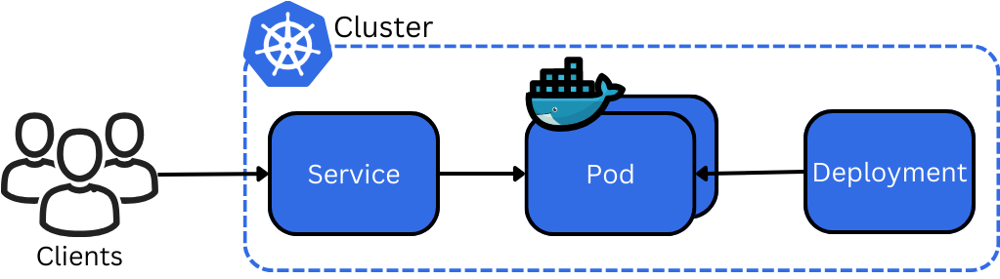
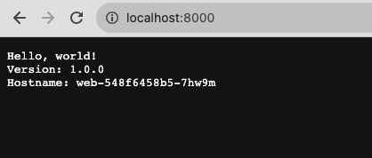

# Deploy Kubernetes Applications with `kind`
[Kubernetes](https://kubernetes.io/), also known as `K8s`, is a popular orchestration platform that is used by [many organizations](https://kubernetes.io/case-studies/) to deploy applications. In this tutorial, we deploy an application with [kind](https://kind.sigs.k8s.io/), a popular tool for local development, to learn the basics of Kubernetes cluster management and deployment.

# Prerequisites
This tutorial requires the following tools:

| Name | Installation instructions |
|------|---------------------------|
|[GitHub account](https://github.com/)| Create an account and set up [Git & GitHub](https://docs.github.com/en/get-started/quickstart/set-up-git) on your local environment.|
|[kind](https://kind.sigs.k8s.io/)| Follow the [official installation steps](https://kind.sigs.k8s.io/docs/user/quick-start#installation) for your operating system.|
|[Docker](https://www.docker.com/)| Follow the [official installation steps](https://www.docker.com/) for your operating system.<br> [Configure Docker Desktop](https://kind.sigs.k8s.io/docs/user/quick-start/#settings-for-docker-desktop) for use with `kind`.|

# Clone GitHub repository
All the code samples in this tutorial are available in a [public GitHub repository](https://github.com/addetz/docs-assignment). You can clone the repository and navigate to its directory to follow along with the instructions:

```shell
$ git clone git@github.com:addetz/docs-assignment.git
$ cd docs-assignment
```

If you have previously cloned the repository using the `git clone` command above, navigate to repository directory and pull any updates:

```shell
$ cd docs-assignment
$ git pull
```

# Kubernetes Fundamentals
Kubernetes is a powerful tool for the management and automation of containerized applications. Containerization is the process of providing an application with an identical, isolated runtime environment. The application is bundled with its dependencies and operates in this environment, regardless of the hardware or operating system where it is deployed. Kubernetes then provides the tools needed to deploy, scale and update containers.

Figure 1 depicts the organisation of the main concepts of Kubernetes:



External **clients** connect to the application that is now managed by Kubernetes:
1. At the highest level, systems are organized into Kubernetes **clusters**. These clusters can run multiple services, on multiple environments or **nodes**. Nodes are the physical servers or Virtual Machines that work can be executed on. Clusters provide a flexible, lightweight way to organise and perform collective operations on a set of related applications.
1. Inside a defined cluster, applications are deployed inside **pods**. While pods may contain multiple containers, they typically host one single container. The pod is responsible for the container's shared resources and for the correct operation of the application. Pods are the smallest unit in Kubernetes and they execute on nodes. 
1. As pods exist in isolated environments, they are not automatically accessible from the outside world. **Services** wrap around the networking requirements of an application, allowing clients to connect to it. 
1. **Deployments** are pod specifications. They can contain a wide variety of specifications such as how many replicas of the application should be running, which service a pod should be running and which ports the pod should expose.

These four main concepts of Kubernetes are all you need to get started. Developers specify and configure Kubernetes clusters, pods, services and deployments with [yaml](https://kubernetes.io/docs/concepts/overview/working-with-objects/). You will see how to do this in the next section. 

# Deploy Applications with `kind`
As with any software project, it is important that developers are able to easily develop and test their solutions locally. The default Kubernetes Command Line Interface (CLI) for communicating with Kubernetes clusters is `kubectl`. It provides all the commands you need to manage your applications. The [`kind` CLI](https://kind.sigs.k8s.io/) builds on top of `kubectl`. It allows you to start and manage Kubernetes clusters locally on top of [Docker](https://www.docker.com/), which makes it a lightweight solution with faster start-up times. This makes `kind` a great tool for local Kubernetes development!
 
Use the command `kind create cluster` to create a Kubernetes cluster. `kind` uses the [`kindest/node` Docker image](https://hub.docker.com/r/kindest/node/tags) to run Kubernetes nodes. Therefore, you need to have the Docker daemon running in order for the cluster creation to succeed. You will see the following output if creation is successful:

```shell
$ kind create cluster
Creating cluster "kind" ...
 ✓ Ensuring node image (kindest/node:v1.27.3) 🖼
 ✓ Preparing nodes 📦
 ✓ Writing configuration 📜
 ✓ Starting control-plane 🕹️
 ✓ Installing CNI 🔌
 ✓ Installing StorageClass 💾
Set kubectl context to "kind-kind"
You can now use your cluster with:

kubectl cluster-info --context kind-kind

Have a nice day! 👋
```

As indicated in the command output, you can check the status of your cluster with the `kubectl cluster-info` command. You will see output that contains the control plane IP address and more:

```shell
$ kubectl cluster-info --context kind-kind
```

## Deploy Application
We have created the file [`app.yaml`](../app.yaml) to specify the deployment of a simple application:

```yml
apiVersion: apps/v1
kind: Deployment
metadata:
  creationTimestamp: null
  labels:
    app: web
  name: web
spec:
  replicas: 1
  selector:
    matchLabels:
      app: web
  strategy: {}
  template:
    metadata:
      creationTimestamp: null
      labels:
        app: web
    spec:
      containers:
      - image: gcr.io/google-samples/hello-app:1.0
        name: hello-app
        resources: {}
status: {}
---
apiVersion: v1
kind: Service
metadata:
  creationTimestamp: null
  labels:
    app: web
  name: web
spec:
  ports:
  - port: 8080
    protocol: TCP
    targetPort: 8080
  selector:
    app: web
  type: NodePort
status:
  loadBalancer: {}
```

This configuration file contains two Kubernetes objects with the following main properties:

|Object| Properties | Specified by |
|------|------------|--------------|
|`Deployment`| Named `web` <br/>  Replicated by 1 pod <br/> Manages pods with the label `app: web` <br/> Pods use the Docker image `hello-app` version `1.0` hosted on the [Google Container Registry](https://console.cloud.google.com/gcr/images/google-samples/GLOBAL/hello-app:1.0/details) | `.metadata.name` <br/> `.spec.replicas` <br/> `.spec.selector.matchLabels` <br/> `.spec.template.spec.image`|
|`Service` | Named `web` <br/> Opens up the port `8080` for listening within the cluster <br/> Service requests are sent through port `8080` <br/>  Manages pods with the label `app: web` <br/> Exposes the service on each node at the specified static port | `.metadata.name` <br/> `.spec.ports.port` <br/> `.spec.ports.targetPort` <br/> `.spec.ports.selector.app` <br/> `.spec.ports.type`|

Next, use the `kubectl apply` command to deploy the application to the previously created `kind` cluster:

```shell
$ kubectl apply -f app.yaml
deployment.apps/web created
service/web created
```
You can check the state of the `web` application using the `kubectl get pods` command and passing the label `app=web` as the selector, which you have applied on both the `Deployment` and the `Service`:

```shell
$ kubectl get pods --selector=app=web 
NAME                   READY   STATUS    RESTARTS   AGE
web-548f6458b5-7hw9m   1/1     Running   0          3m
``` 

The `web` pod is deployed succesfully, as you can in the `Running` status. The pod has random characters appended to its name to make it easier for the Kubernetes controller to keep track of deployed versions. These random characters will be different on your system and will change every time the pod is redeployed. 

## Forward Application Traffic
Even though the `web` application is ready and waiting for traffic at this point, it is not yet accessible to the outside world. The isolated containers need to expose their ports to the local system through **port forwarding**. This will instruct the local system to forward connections on a given local port to a selected pod instead.   

First, issue the following command to extract the pod name to an environment variable:

```shell
$ PODNAME=$(kubectl get pods --template '{{range .items}}{{.metadata.name}}{{end}}' --selector=app=web)
```

Next, use the `kubectl port-forward` command together with the `PODNAME` environment variable and the configured target port of `8080`:

```shell
$ kubectl port-forward $PODNAME 8000:8080
Forwarding from 127.0.0.1:8000 -> 8080
Forwarding from [::1]:8000 -> 8080
```
This command forwards traffic from the local port of `8000` to the pod port of `8080`. If you visit `localhost:8000` you will see the `Hello World!` welcome page:



You have now successfully deployed and connected to the `hello-app` on your local `kind` Kubernetes cluster!

# Cleanup
Once you have finished working with your cluster, you can easily clean up all its resources with the `kind delete cluster` command:

```shell
$ kind delete cluster
Deleting cluster "kind" ...
Deleted nodes: ["kind-control-plane"]
```

# Next Steps
As mentioned before Kubernetes is an orchestration platform used to deploy containerized applications. We hope you now better understand how to deploy Kubernetes applications locally using `kind`. The tutorial ["Deploy an Application using Palette Dev Engine"](https://docs.spectrocloud.com/devx/apps/deploy-app/) teaches you how to deploy applications to the cloud and is an excellent follow up to this guide. 


